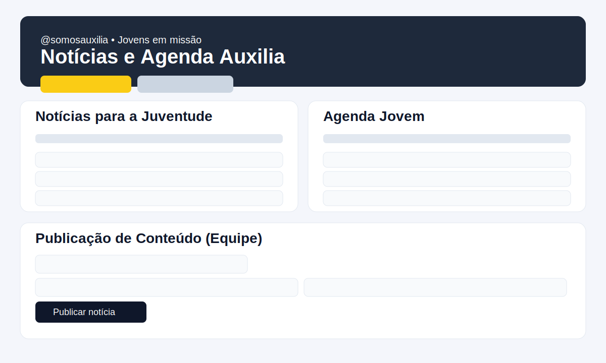

# Auxilia App Beta

Website do movimento salesiano/católico com dois focos:
- **Consagrados**: guia de oração, missão e norteador das atividades.
- **Jovens**: experiência com atividades e notícias do mundo salesiano.

## Preview visual da home


## Stack
- Next.js (deploy na Vercel)
- Firebase Client SDK (Firestore + Analytics)
- Firebase Admin SDK (validação server-side para publicação)

## Rodando localmente
```bash
npm install
npm run dev
```

## Configuração do Firebase
1. Copie `.env.example` para `.env.local`.
2. O projeto já traz os dados públicos do app web (`NEXT_PUBLIC_*`).
3. Para recursos server-side, preencha as variáveis do Admin SDK:
   - `FIREBASE_ADMIN_PROJECT_ID`
   - `FIREBASE_ADMIN_CLIENT_EMAIL`
   - `FIREBASE_ADMIN_PRIVATE_KEY`
   - `CONTENT_ADMIN_EMAILS` (lista separada por vírgula)
4. Crie as coleções no Firestore:
   - `noticias`: `titulo` (string), `resumo` (string), `categoria` (string)
   - `atividades`: `titulo` (string), `local` (string), `data` (string), `publico` (string)
5. Publique as regras em `firestore.rules`.

Se não houver conexão com o Firebase, o site exibe notícias de exemplo.

## Governança de conteúdo
A publicação de conteúdo segue o fluxo abaixo:

1. Usuário faz login com Google no front.
2. Front envia token Firebase ID para `POST /api/admin/content`.
3. API valida token via Firebase Admin e confere e-mail em `CONTENT_ADMIN_EMAILS`.
4. Somente após validação o documento é criado no Firestore.

Com isso, a autorização não fica mais no client, e sim no servidor + regras de segurança.

## Documentação do modelo de dados
- Veja `docs/data-model.md` para estrutura das coleções, campos e metadados.

## Arquivos principais de integração
- `lib/firebase.ts`: inicializa app client, Firestore e Analytics.
- `lib/firebaseAdmin.ts`: inicializa Admin SDK para validações server-side.
- `app/api/admin/content/route.ts`: endpoint seguro para publicação de notícias/atividades.
- `firestore.rules`: regras recomendadas para leitura/escrita.

## Deploy na Vercel
1. Suba o projeto para o GitHub.
2. Importe na Vercel.
3. Configure as variáveis de ambiente da `.env.example` no painel da Vercel.
4. Faça deploy.

## Ajuste para erro de output na Vercel
Se o projeto estiver com erro **"Nenhum diretório de saída chamado public"**, este repositório já define `vercel.json` com `outputDirectory: ".next"`, compatível com Next.js.

## Canais oficiais utilizados para adaptação
- https://www.instagram.com/somosauxilia/
- https://www.facebook.com/somosauxilia/?locale=pt_BR
- https://www.youtube.com/c/somosauxilia
